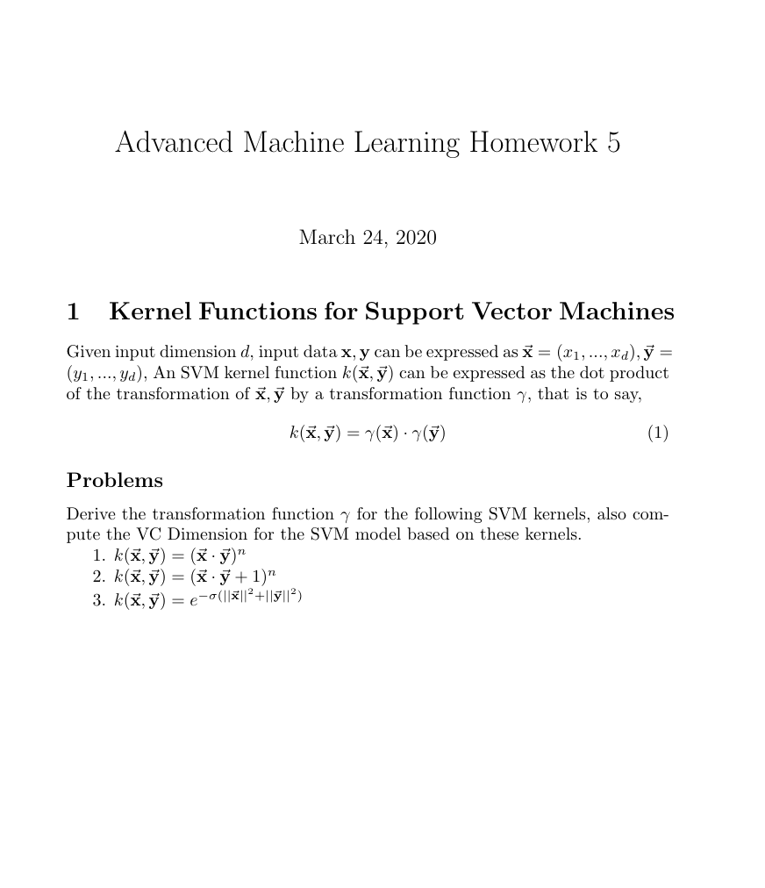

# Advanced Machine Learning Homework 5

1. $$ k(\vec x, \vec y) = (\vec x\cdot \vec y)^{n}$$
   

2.  $$ k(\vec x, \vec y) = (\vec x\cdot \vec y + 1)^{n}$$

3.  $$ k(\vec x, \vec y) = e^{-\sigma(\|\vec x\|^{2} + \|\vec y\|^{2})}$$